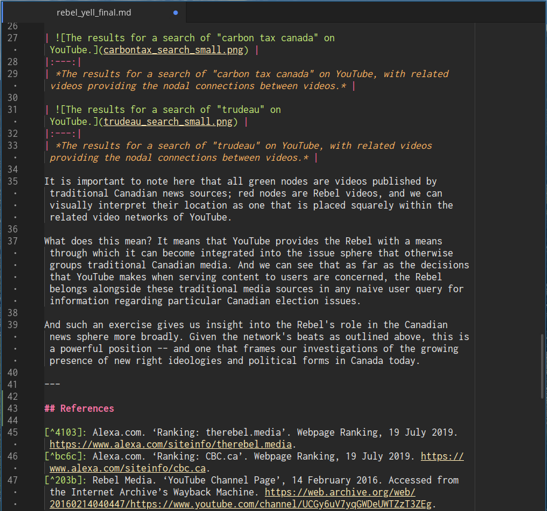

# commentariat: academic writing in markdown that lets you focus on the content

Commentariat is a dark syntax theme explicitly designed for writing papers, essays, academic articles, and others in [markdown](https://en.wikipedia.org/wiki/Markdown). Despite the maturity of Atom's theming framework, there are few options available for dark themes to those interested in using Atom as an academic toolkit, and I find that writing with darker backgrounds and lighter text makes it easier to focus on the task at hand. If you want a light theme, I highly recommend [Pen-Paper-Coffee](https://atom.io/themes/pen-paper-coffee-syntax)).
The theme features a pastel-based color scheme for a decent amount of contrast while writing the syntactic elements of markdown. The colors are mapped to a variety of different elements for differentiation, and the end result is being able to see each independent change or addition to your own plain text writing without the contrast between each element causing a headache, obviously important to writing the types of long documents characteristic of academic writing.  
For an effective and seamless academic workflow writing in markdown in atom, I suggest the following extensions:

1. For making citations an _incredibly_ easier workflow, I recommend installing [autocomplete-bibtex](https://atom.io/packages/autocomplete-bibtex). I've found that other solutions for citations are not nearly as seamless (i.e. the Zotero citation picker plugins available). Having autocomplete-bibtex installed alongside the Better BiBTeX plugin for Zotero (and exporting an automatically-updating .bibtex keyfile) allows you to hit the @ symbol in any markdown file and immediately fill in that citation very, very easily.
2. The other game-changer is [markdown-footnote](https://atom.io/packages/markdown-footnote). This allows you to hit a keyboard shortcut and immediately add a footnote to markdown documents. The _key_ feature that it has over other markdown footnote plugins, however, is the keybinding to return to where you plugged in the footnote back in the document---making for a seamless workflow when it comes to footnotes and citations together with autocomplete-bibtex.
3. [Zen](https://atom.io/packages/Zen) for distraction-free writing. It blows the current writing window up to full screen, letting you dive in to whatever piece requires your focused attention.
4. [Advanced Open File](https://atom.io/packages/advanced-open-file) is much more effective than atom's built-in file browsing utilities, and allows you to quickly consult lists of notes or open outline documents that will help you with your writing.
5. If you want to _really_ superpower your academic project frameworks, I recommend installing [project-manager](https://atom.io/packages/project-manager).
6. [Markdown-table-editor](https://atom.io/packages/markdown-table-editor) makes the addition of tables super easy. No more searching for 'csv to markdown converter' every time you have a csv that you need to convert into a table.
7. [wordcount](https://atom.io/packages/wordcount) does what it says.
8. If you're feeling hardcore, linter plugins to improve your prose can be installed with [linter-write-good](https://atom.io/packages/linter-write-good) and [linter-proselint](https://atom.io/packages/linter-proselint). They both require the basic [linter framework](https://atom.io/packages/linter). My caveat with suggesting these is the prescriptivism they push the user towards---while they often catch things that should never be used like passive voice, they both also tend to throw a fit at "weasel words" like "very" or any other qualifying adjective, which can force a standardization of writing that sucks the voice and life out of one's own writing style if not taken with a grain of salt. Proselint, especially, seems to think that the sparse style characteristic of Hemingway and other male realist authors is the only correct style, when in reality such decisions come down to stylistic, aesthetic, and contextual preference.  

This syntax theme started from an edit of [monokai-solarized-dark](https://atom.io/packages/monokai-solarized-dark).
